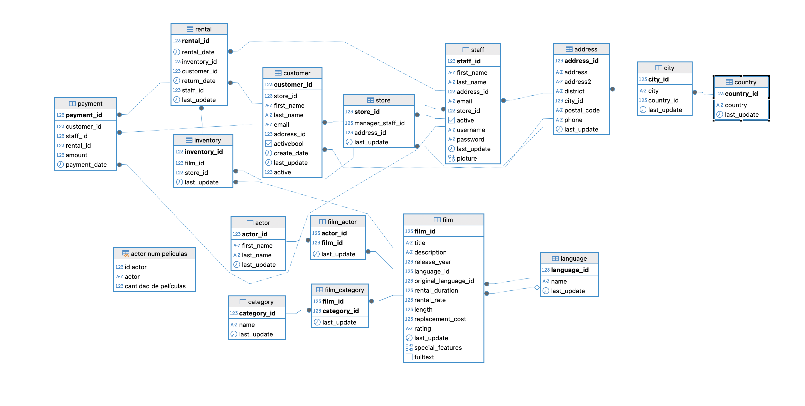

# ProyectoConsultasSQL





The objective of this project is to solve various SQL queries that encompass all the concepts learned in the SQL module.

## Description of the project
The objective of this project is to solve a series of SQL queries that demonstrate the application of all the key concepts learned throughout the SQL module. The statements of the queries are provided in the document named "EnunciadoDataProject_SQL.Lógica.pdf".

During the SQL module, we covered the following topics:
- Fundamentals of SQL
- Basic queries
- Aggregation queries
- Sorting and grouping queries
- Relationships between tables
- Subqueries
- Views
- Temporary data structures

This project serves as a practical summary of the module, allowing us to apply our knowledge to real-world database scenarios.

## Structure of the project
```bash
ProyectoConsultasSQL/
|--BBDD_Proyecto.sql # Database we worked with
|--DataProject_SQL_Diagram.jpeg #Database diagram
|--DataProject_SQL.sql # The SQL queries with their solutions
|--EnunciadoDataProject_SQL.Lógica.pdf # SQL query statements
|--README.md
```

## Project development
In that part, we describe the process followed to complete the project.

### First step
- Create a new PostgreSQL

### Second step
- Load the supplied database file into DBeaver to start working with it.

### Third step
- Create the diagram view to help us understand the data we are working with.

### Fourth step
- Provide solutions to the different queries outlined in the document.

### Fifth step
- Complete the README file with the explanation of the project and the analysis summary.

## Analysis report

In this project, I have executed a wide range of SQL queries to practice and apply the concepts learned during the SQL module. The queries cover various fundamental and advanced topics, demonstrating the ability to manipulate and retrieve data efficiently from a relational database.

### Overview of SQL Queries

The SQL queries addressed the following tasks:
- **Database schema creation** to define the structure and relationships of the database.
- **Filtering and selection** of data based on conditions such as movie ratings, actor IDs, and language matching.
- **Sorting and ordering** movies by attributes like duration.
- **String pattern matching** to find actors with specific last names.
- **Aggregation functions** such as COUNT, AVG, MAX, MIN, VARIANCE, and STDDEV to summarize data like total movies per rating, average duration, and total revenue.
- **Complex filtering** involving multiple conditions (e.g., movies rated 'PG-13' or longer than 3 hours).
- **Subqueries and nested queries** to extract specific records like the antepenultimate rental cost.
- **Handling NULLs and optional relationships** by using LEFT JOINs to include movies without actors or actors without movies.
- **Use of views and temporary tables** for organizing intermediate results.
- **Calculations involving monetary values** such as total revenue generated and customers’ spending.
- **Grouping and counting** actors by names, rentals by dates, and movies by categories.
- **Advanced joins** including CROSS JOIN and their practical implications.
- **Creation of combined columns** (e.g., concatenating first and last names).
- **Queries involving rental periods, movie categories, and customer activity.**

### Key Learnings and Insights
 - The project reinforced the importance of structuring queries clearly to handle both simple and complex data retrieval tasks.
 - Aggregation and grouping queries helped understand how to summarize large datasets efficiently.
- Use of temporary tables and views provided better organization and reusability in complex query workflows.

## Conlusion

This project allowed me to apply a comprehensive set of SQL skills to a realistic dataset, covering fundamental to advanced topics. It has enhanced my ability to write efficient, accurate, and meaningful SQL queries to extract valuable insights from a database.

## Contributions
Your contributions are appreciated. Please feel free to reach out with any suggestions, enhancements, or corrections.  

Any kind of contribution — whether it's code, documentation, or feedback — will be appreciated. Thank you for your help and collaboration.

## Author
- Daniela - [GitHub Profile](https://github.com/danielamichellod)
